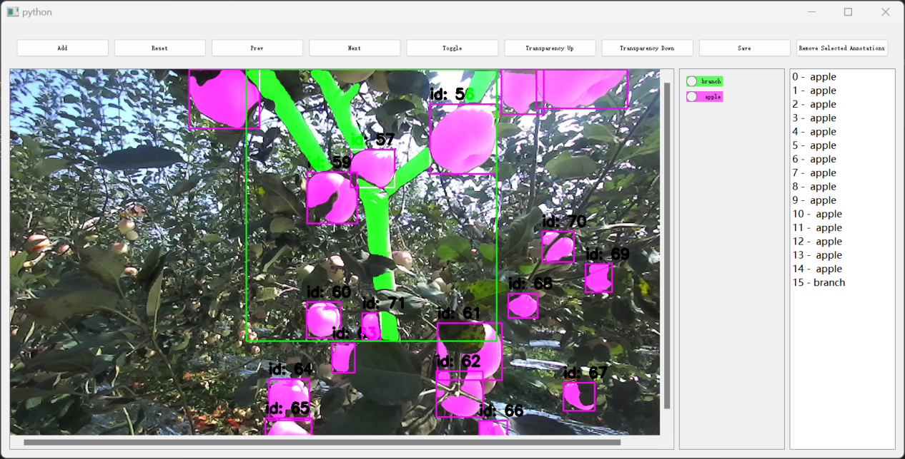

# LED-Inst
LED-Net: A lightweight and efficient dual-branch convolutional neural network designed to address the challenge of achieving high-performance tree branch and trunk semantic segmentation in resource-constrained mobile device environments.

# NWPU_Apple_Seg_Data

**NWPU_Apple_Seg_Data** is a high-quality apple instance segmentation dataset collected in an orchard in Liquan County, Shaanxi Province, China. The orchard features a spacing layout of 3.5 m (rows) and 1.2 m (trees). Images were captured during the harvest season (September–October 2023) using a ZED stereo camera (1280 × 720 resolution) mounted on a laptop.

To simulate the viewpoint of robotic harvesting, the camera was positioned 50–80 cm from fruiting branches and used to collect data between 08:00 and 17:00 each day. The dataset captures rich field variability, including differences in illumination (high-intensity, overexposed, low-light, and normal), viewpoints (upward, top-down, and frontal), and time of day (morning, midday, and dusk).

## 📌 Data Samples
Below are representative examples showing the diversity of lighting, viewpoints, and orchard conditions:

Over 2,000 raw images were acquired, and 1,486 valid samples were retained after manual inspection. All instance masks were annotated using the Segment Anything model for high-quality segmentation.

## 📌 Example of Annotations
Instance segmentation masks were generated using SAM; an example is shown below:

The dataset is divided into training and validation subsets in an 8:2 ratio to support model development and evaluation.

## 📥 Download

The dataset is publicly available on Google Drive:

🔗 **Download Link:**  
https://drive.google.com/drive/u/0/folders/1Yw_rb0LoRG5CbLaSbzgNX7aReTlF5cWA

The repository includes two downloadable files:

- **NWPU-Apple Branch Seg data.zip**  
  → Contains all RGB orchard images.

- **Annotations CocoJson.zip**  
  → Contains COCO-style instance segmentation JSON annotations.

## 📌 Description
**NWPU_Apple_Seg_Data** provides a diverse and realistic benchmark for apple instance segmentation, suitable for research in agricultural robotics, fruit detection, yield estimation, and autonomous harvesting.

